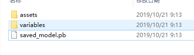

### 基础环境

1. win10 / ubuntu
2. tensorflow 1.4（keras, 2.2.4-tf)
3. python 3.7.3

### 核心步骤

tensorflow提供了java版本的一些接口API,可以在官网查询到，这些API都是基于JNI来实现的，所以需要把相关的库文件（windows,dll/ linux,so) 放在  *java.libary.path* 对应的目录下面,就可以调用相关api，导入模型了。

#### python 训练

首先通过python训练好keras模型，然后通过 *tf.keras.experimental.export_saved_model* 接口导出 **SavedModel** 到指定的目录:

```python
    model = ...
    tf.keras.experimental.export_saved_model(model, <save dir>)
```

导出后的模型是一个文件夹：



通过 *saved_model_cli* 命令输出 **SavedModel** 的输入层和输出层信息：

```
> saved_model_cli show --dir F:\DataWorkspace\ddos\mdata\ --tag_set serve --signature_def serving_default
> 
The given SavedModel SignatureDef contains the following input(s):
  inputs['flatten_input'] tensor_info:
      dtype: DT_FLOAT
      shape: (-1, 18)
      name: flatten_input:0
The given SavedModel SignatureDef contains the following output(s):
  outputs['dense_1'] tensor_info:
      dtype: DT_FLOAT
      shape: (-1, 2)
      name: dense_1/Sigmoid:0
Method name is: tensorflow/serving/predict
``` 

记录下输入层和输出层的名称，java导入模型时需要使用。

#### java 部署

配置好tensorflow依赖，和JNI库文件


通过 tag 导入 **SavedModel**:

```java
String path = "..." // 模型存储的目录
SavedModelBundle model = SavedModelBundle.load(path, "serve")
```

创建输入Tensor

```
float [][] data = new float[1][size];
Tensor input = input.create(data)
```

>注意： 输入的data，保证至少为二维的数组，否则会创建一个一维的Tensor，java中，会出现矩阵相乘维度不匹配的情况

输入数据，得到输出层结果，输出层输出的也是一个Tensor，需要转换为float数组，从而获取最大的那个值

```java
Tensor output = model.session().runner().feed("flatten_input", x)
                        .fetch("dense_1/Sigmoid").run().get(0).expect(Float.class);
int maxObjects = (int) output.shape()[1];
// 类型转换
float[][] y = new float[1][maxObjects];
output.copyTo(y);

```
